# Практика I


```r
setwd(dirname(rstudioapi::getActiveDocumentContext()$path))
# getwd()
```


```r
library(tidyverse)
```

```
## ── Attaching packages ─────────────────────────────────────── tidyverse 1.3.2 ──
## ✔ ggplot2 3.4.2     ✔ purrr   1.0.1
## ✔ tibble  3.2.1     ✔ dplyr   1.1.2
## ✔ tidyr   1.3.0     ✔ stringr 1.5.0
## ✔ readr   2.1.3     ✔ forcats 0.5.2
## ── Conflicts ────────────────────────────────────────── tidyverse_conflicts() ──
## ✖ dplyr::filter() masks stats::filter()
## ✖ dplyr::lag()    masks stats::lag()
```

```r
library(dplyr)
library(dada2)
```

```
## Loading required package: Rcpp
```

```r
library(phyloseq)
set.seed(5678)
```


## Загрузка данных


```r
path <- 'sequences'
list.files(path)[1:6]
```

```
## [1] "Abacumov-B-1_S1_L001_R1_001.fastq.gz"  
## [2] "Abacumov-B-1_S1_L001_R2_001.fastq.gz"  
## [3] "Abacumov-B-13_S13_L001_R1_001.fastq.gz"
## [4] "Abacumov-B-13_S13_L001_R2_001.fastq.gz"
## [5] "Abacumov-B-14_S14_L001_R1_001.fastq.gz"
## [6] "Abacumov-B-14_S14_L001_R2_001.fastq.gz"
```


```r
metadata <- read.csv('map.csv')
metadata$SampleID <- paste(metadata$Source, metadata$Site, metadata$Horizont, metadata$Repeat, sep=".")
```


```r
# Forward and reverse fastq filenames have format: SAMPLENAME_R1_001.fastq and SAMPLENAME_R2_001.fastq
fnFs <- sort(list.files(path, pattern="_R1_001.fastq", full.names = TRUE))
fnRs <- sort(list.files(path, pattern="_R2_001.fastq", full.names = TRUE))
# Extract sample names, assuming filenames have format: SAMPLENAME_XXX.fastq
sample.names <- sapply(strsplit(basename(fnFs), "_"), `[`, 1)
sample.names[1:6]
```

```
## [1] "Abacumov-B-1"  "Abacumov-B-13" "Abacumov-B-14" "Abacumov-B-15"
## [5] "Abacumov-B-16" "Abacumov-B-2"
```

## DADA2 пайплайн

### Проверка качества исходных прочтений

**Прямые прочтения**


```r
plot_Fs <- plotQualityProfile(fnFs, aggregate = T)
```

```
## Warning: The `<scale>` argument of `guides()` cannot be `FALSE`. Use "none" instead as
## of ggplot2 3.3.4.
## ℹ The deprecated feature was likely used in the dada2 package.
##   Please report the issue at <https://github.com/benjjneb/dada2/issues>.
## This warning is displayed once every 8 hours.
## Call `lifecycle::last_lifecycle_warnings()` to see where this warning was
## generated.
```

```r
plot_Fs <- plot_Fs + ggtitle('Качество исходных прямых прочетний')
ggsave('plot_Fs.png',plot_Fs, dpi=300, width=6, height = 5)
plot_Fs
```

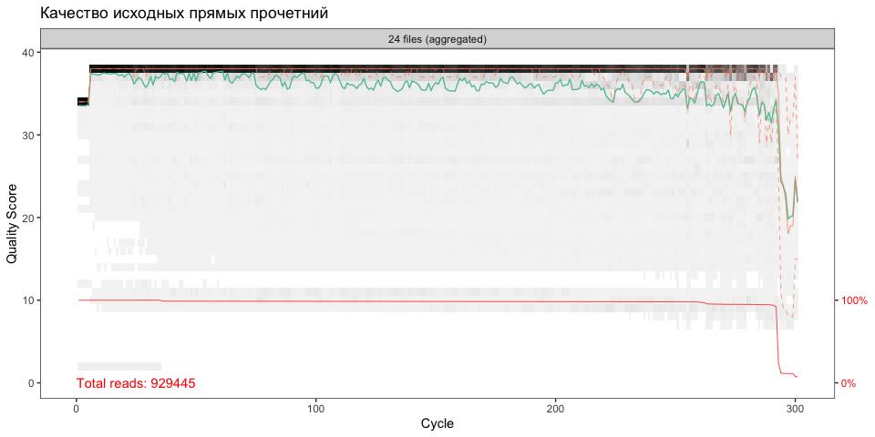<!-- -->

В начале прочетний качество чуть хуже, но потом становится стабильно высоким. К концу прочтений качество ухудшается. Не все прочтения длинной 300 bp (красная линия).

**Обратные прочтения**


```r
plot_Rs <- plotQualityProfile(fnRs, aggregate = T)
plot_Rs <- plot_Rs + ggtitle('Качество исходных обратных прочетний')
ggsave('plot_Rs.png',plot_Rs, dpi=300, width=6, height = 5)
plot_Rs
```

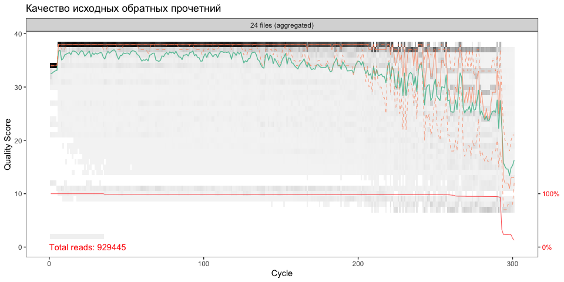<!-- -->

Качество схоже с прямыми прочтениями, но общее качество начинается падать раньше.

### Тримминг прочтений


```r
filtFs <- file.path(path, "filtered", paste0(sample.names, "_F_filt.fastq.gz"))
filtRs <- file.path(path, "filtered", paste0(sample.names, "_R_filt.fastq.gz"))
names(filtFs) <- sample.names
names(filtRs) <- sample.names

out <- filterAndTrim(fnFs, filtFs, fnRs, filtRs, truncLen=c(240,180),
              maxN=0, maxEE=c(2,2), truncQ=2, rm.phix=TRUE,
              compress=TRUE, multithread=TRUE)
head(out)
```

```
##                                        reads.in reads.out
## Abacumov-B-1_S1_L001_R1_001.fastq.gz      43307     36622
## Abacumov-B-13_S13_L001_R1_001.fastq.gz    41438     34160
## Abacumov-B-14_S14_L001_R1_001.fastq.gz    38072     31002
## Abacumov-B-15_S15_L001_R1_001.fastq.gz    46395     37918
## Abacumov-B-16_S16_L001_R1_001.fastq.gz    47274     38962
## Abacumov-B-2_S2_L001_R1_001.fastq.gz      45972     39386
```

Проверим качество прочтений после тримминга

**Прямые прочтения**


```r
plot_filtFs <- plotQualityProfile(filtFs, aggregate = T)
plot_filtFs <- plot_filtFs + ggtitle('Качество прямых прочетний после тримминга')
ggsave('plot_filtFs.png',plot_filtFs, dpi=300, width=6, height = 5)
plot_filtFs
```

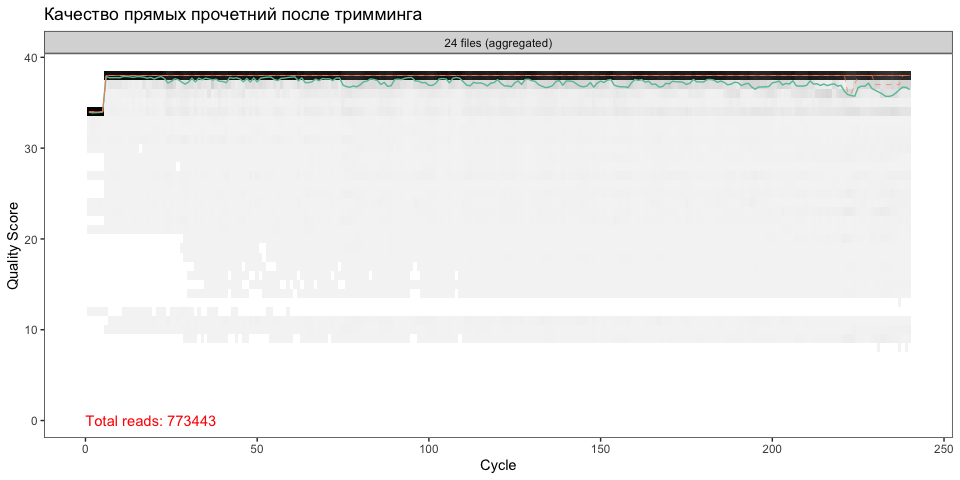<!-- -->

Длина прочтений уменьшилась, все прочтения имеют одинаковую длину 240 bp. Общее качество прочтений улучшилось, но ступенчатый паттерн в начале остался. Качество прочтений стало подходящим для дальнейшего анализа.

**Обратные прочтения**


```r
plot_filtRs <- plotQualityProfile(filtRs, aggregate = T)
plot_filtRs <- plot_filtRs + ggtitle('Качество обратных прочетний после тримминга')
ggsave('plot_filtRs.png',plot_filtRs, dpi=300, width=6, height = 5)
plot_filtRs
```

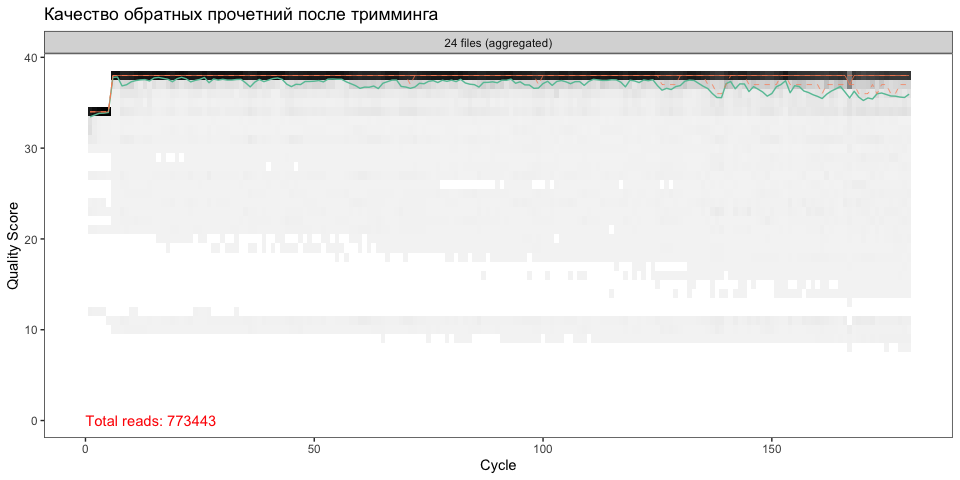<!-- -->

Аналогично прямым прочтениям. Длина прочтений стала меньше 180 bp.

### Построение и применение модели


```r
errF <- learnErrors(filtFs, multithread=TRUE)
```

```
## 101232000 total bases in 421800 reads from 14 samples will be used for learning the error rates.
```

```r
errR <- learnErrors(filtRs, multithread=TRUE)
```

```
## 100742940 total bases in 559683 reads from 18 samples will be used for learning the error rates.
```


```r
plot_errF <- plotErrors(errF, nominalQ=TRUE) + ggtitle('Прямые прочтения')
ggsave('plot_errF.png',plot_errF, dpi=300, width=8, height = 6)
```

```
## Warning: Transformation introduced infinite values in continuous y-axis
## Transformation introduced infinite values in continuous y-axis
```

```r
plot_errF
```

```
## Warning: Transformation introduced infinite values in continuous y-axis
## Transformation introduced infinite values in continuous y-axis
```

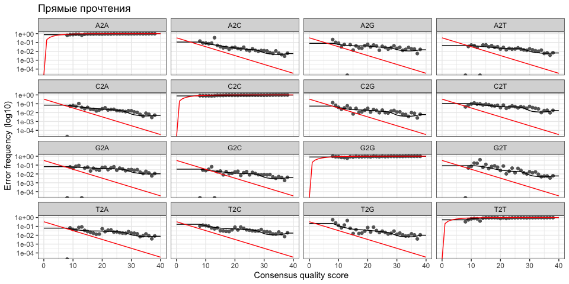<!-- -->


```r
plot_errR <- plotErrors(errR, nominalQ=TRUE) + ggtitle('Обратные прочтения')
ggsave('plot_errR.png',plot_errR, dpi=300, width=8, height = 6)
```

```
## Warning: Transformation introduced infinite values in continuous y-axis
## Transformation introduced infinite values in continuous y-axis
```

```r
plot_errR
```

```
## Warning: Transformation introduced infinite values in continuous y-axis
## Transformation introduced infinite values in continuous y-axis
```

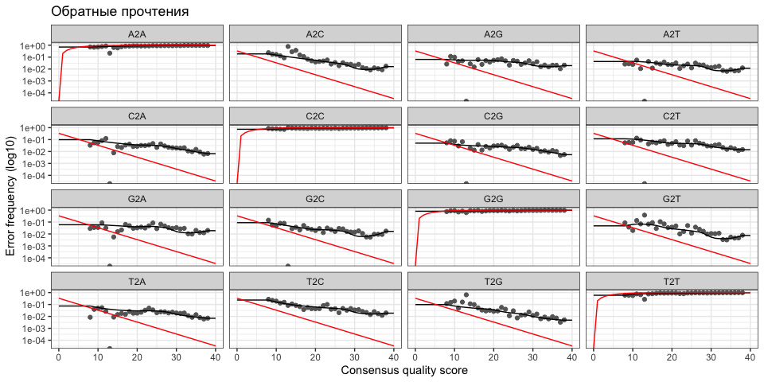<!-- -->


```r
dadaFs <- dada(filtFs, err=errF, multithread=TRUE)
```

```
## Sample 1 - 36622 reads in 28087 unique sequences.
## Sample 2 - 34160 reads in 18735 unique sequences.
## Sample 3 - 31002 reads in 18643 unique sequences.
## Sample 4 - 37918 reads in 19870 unique sequences.
## Sample 5 - 38962 reads in 20810 unique sequences.
## Sample 6 - 39386 reads in 30781 unique sequences.
## Sample 7 - 22676 reads in 6818 unique sequences.
## Sample 8 - 17052 reads in 5663 unique sequences.
## Sample 9 - 19659 reads in 6237 unique sequences.
## Sample 10 - 19501 reads in 5706 unique sequences.
## Sample 11 - 47256 reads in 33296 unique sequences.
## Sample 12 - 26915 reads in 19311 unique sequences.
## Sample 13 - 27806 reads in 20185 unique sequences.
## Sample 14 - 22885 reads in 17428 unique sequences.
## Sample 15 - 34065 reads in 26006 unique sequences.
## Sample 16 - 24332 reads in 18733 unique sequences.
## Sample 17 - 45257 reads in 27334 unique sequences.
## Sample 18 - 34229 reads in 21495 unique sequences.
## Sample 19 - 42869 reads in 27611 unique sequences.
## Sample 20 - 31780 reads in 20178 unique sequences.
## Sample 21 - 41246 reads in 30101 unique sequences.
## Sample 22 - 33175 reads in 23318 unique sequences.
## Sample 23 - 32469 reads in 22700 unique sequences.
## Sample 24 - 32221 reads in 23605 unique sequences.
```

```r
dadaRs <- dada(filtRs, err=errR, multithread=TRUE)
```

```
## Sample 1 - 36622 reads in 28652 unique sequences.
## Sample 2 - 34160 reads in 19562 unique sequences.
## Sample 3 - 31002 reads in 18627 unique sequences.
## Sample 4 - 37918 reads in 19876 unique sequences.
## Sample 5 - 38962 reads in 20775 unique sequences.
## Sample 6 - 39386 reads in 31028 unique sequences.
## Sample 7 - 22676 reads in 7053 unique sequences.
## Sample 8 - 17052 reads in 5659 unique sequences.
## Sample 9 - 19659 reads in 7019 unique sequences.
## Sample 10 - 19501 reads in 5888 unique sequences.
## Sample 11 - 47256 reads in 34628 unique sequences.
## Sample 12 - 26915 reads in 20489 unique sequences.
## Sample 13 - 27806 reads in 20955 unique sequences.
## Sample 14 - 22885 reads in 17871 unique sequences.
## Sample 15 - 34065 reads in 26746 unique sequences.
## Sample 16 - 24332 reads in 19350 unique sequences.
## Sample 17 - 45257 reads in 28159 unique sequences.
## Sample 18 - 34229 reads in 22116 unique sequences.
## Sample 19 - 42869 reads in 28277 unique sequences.
## Sample 20 - 31780 reads in 21109 unique sequences.
## Sample 21 - 41246 reads in 31022 unique sequences.
## Sample 22 - 33175 reads in 24219 unique sequences.
## Sample 23 - 32469 reads in 23696 unique sequences.
## Sample 24 - 32221 reads in 24015 unique sequences.
```

### Объединение прочтений и создание таблицы


```r
mergers <- mergePairs(dadaFs, filtFs, dadaRs, filtRs, verbose=TRUE)
```

```
## 15729 paired-reads (in 416 unique pairings) successfully merged out of 27255 (in 4019 pairings) input.
```

```
## 22924 paired-reads (in 625 unique pairings) successfully merged out of 30302 (in 3396 pairings) input.
```

```
## 19335 paired-reads (in 524 unique pairings) successfully merged out of 27027 (in 3343 pairings) input.
```

```
## 26430 paired-reads (in 702 unique pairings) successfully merged out of 34157 (in 3582 pairings) input.
```

```
## 27267 paired-reads (in 730 unique pairings) successfully merged out of 34815 (in 3483 pairings) input.
```

```
## 16156 paired-reads (in 409 unique pairings) successfully merged out of 28750 (in 4321 pairings) input.
```

```
## 19847 paired-reads (in 475 unique pairings) successfully merged out of 21816 (in 1222 pairings) input.
```

```
## 14224 paired-reads (in 389 unique pairings) successfully merged out of 16302 (in 1077 pairings) input.
```

```
## 16700 paired-reads (in 416 unique pairings) successfully merged out of 18925 (in 1182 pairings) input.
```

```
## 17225 paired-reads (in 415 unique pairings) successfully merged out of 18993 (in 1045 pairings) input.
```

```
## 22615 paired-reads (in 620 unique pairings) successfully merged out of 36917 (in 5423 pairings) input.
```

```
## 11775 paired-reads (in 329 unique pairings) successfully merged out of 21544 (in 3228 pairings) input.
```

```
## 12074 paired-reads (in 349 unique pairings) successfully merged out of 22312 (in 3288 pairings) input.
```

```
## 9115 paired-reads (in 236 unique pairings) successfully merged out of 17755 (in 2532 pairings) input.
```

```
## 14492 paired-reads (in 393 unique pairings) successfully merged out of 25241 (in 3708 pairings) input.
```

```
## 9929 paired-reads (in 281 unique pairings) successfully merged out of 18440 (in 2615 pairings) input.
```

```
## 26537 paired-reads (in 764 unique pairings) successfully merged out of 38769 (in 4673 pairings) input.
```

```
## 19792 paired-reads (in 566 unique pairings) successfully merged out of 28803 (in 3524 pairings) input.
```

```
## 23682 paired-reads (in 611 unique pairings) successfully merged out of 36076 (in 4669 pairings) input.
```

```
## 17117 paired-reads (in 533 unique pairings) successfully merged out of 26351 (in 3344 pairings) input.
```

```
## 18224 paired-reads (in 443 unique pairings) successfully merged out of 33192 (in 5163 pairings) input.
```

```
## 14348 paired-reads (in 385 unique pairings) successfully merged out of 26975 (in 3871 pairings) input.
```

```
## 14376 paired-reads (in 386 unique pairings) successfully merged out of 26025 (in 3621 pairings) input.
```

```
## 13777 paired-reads (in 341 unique pairings) successfully merged out of 25769 (in 3546 pairings) input.
```


```r
seqtab <- makeSequenceTable(mergers)
```

### Удаление химер


```r
seqtab.nochim <- removeBimeraDenovo(seqtab, method="consensus", multithread=TRUE, verbose=TRUE)
```

```
## Identified 1947 bimeras out of 7004 input sequences.
```

```r
dim(seqtab.nochim)
```

```
## [1]   24 5057
```

```r
sum(seqtab.nochim)/sum(seqtab)
```

```
## [1] 0.8055394
```

### Проверка количества прочтений на каждой стадии предобработки


```r
getN <- function(x) sum(getUniques(x))
track <- cbind(out, sapply(dadaFs, getN), sapply(dadaRs, getN), sapply(mergers, getN), rowSums(seqtab.nochim))
# If processing a single sample, remove the sapply calls: e.g. replace sapply(dadaFs, getN) with getN(dadaFs)
colnames(track) <- c("input", "filtered", "denoisedF", "denoisedR", "merged", "nonchim")
rownames(track) <- sample.names
head(track)
```

```
##               input filtered denoisedF denoisedR merged nonchim
## Abacumov-B-1  43307    36622     29113     32777  15729   14462
## Abacumov-B-13 41438    34160     31668     32193  22924   17630
## Abacumov-B-14 38072    31002     28282     29053  19335   15500
## Abacumov-B-15 46395    37918     35599     35901  26430   19483
## Abacumov-B-16 47274    38962     36181     36939  27267   19850
## Abacumov-B-2  45972    39386     30707     35254  16156   14720
```


```r
stages_df <- as.data.frame(track) 
stages_df$sample <- rownames(stages_df)
stages_df <- stages_df %>% gather('stage', 'nreads',-sample)
stages_df$stage <- factor(stages_df$stage,level=colnames(track))
ggplot(stages_df,aes(x=stage, y=nreads, color=stage))+
  geom_boxplot()+xlab('Стадия предобработки')+
  ylab('Количество прочтений')+
  theme(legend.position = 'none') -> plot_stages 

ggsave('plot_stages.png', plot_stages, dpi=300, width=7, height = 5)
plot_stages
```

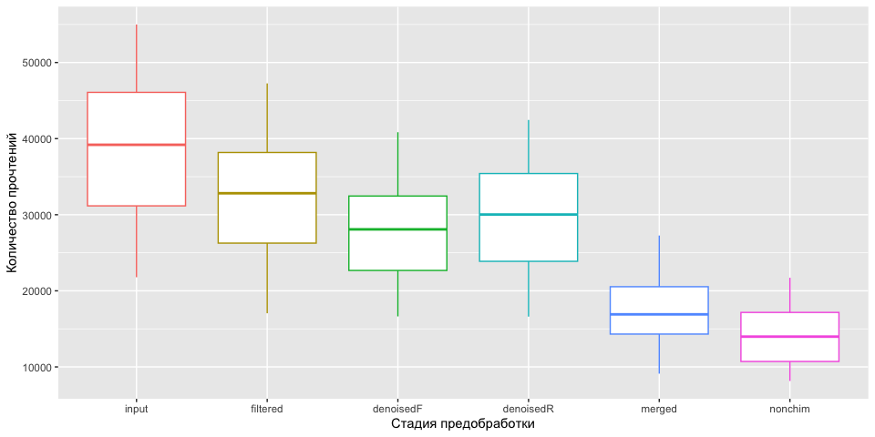<!-- -->

Наблюдается значительное уменьшение количества прочтений после тримминга и фильтрации и после слияния прочтений. Чтобы осталось больше прочтений можно сделать фильтрацию более слабой. Такое сильное снижение может говорить о среднем качестве секвенирования.

### Аннотация таксономии


```r
taxa <- assignTaxonomy(seqtab.nochim, "silva_nr_v132_train_set.fa.gz", multithread=TRUE)

taxa.print <- taxa # Removing sequence rownames for display only
rownames(taxa.print) <- NULL
head(taxa.print)
```

```
##      Kingdom    Phylum          Class              Order        Family Genus
## [1,] "Bacteria" "Chloroflexi"   "AD3"              NA           NA     NA   
## [2,] "Bacteria" "Chloroflexi"   "AD3"              NA           NA     NA   
## [3,] "Bacteria" "Chloroflexi"   "AD3"              NA           NA     NA   
## [4,] "Bacteria" "Chloroflexi"   "AD3"              NA           NA     NA   
## [5,] "Bacteria" "Cyanobacteria" "Oxyphotobacteria" "Nostocales" NA     NA   
## [6,] "Bacteria" "Cyanobacteria" "Oxyphotobacteria" "Nostocales" NA     NA
```


```r
rownames(metadata) <- metadata$Filename

ps <- phyloseq(otu_table(seqtab.nochim, taxa_are_rows=FALSE), 
               sample_data(metadata), 
               tax_table(taxa))
ps
```

```
## phyloseq-class experiment-level object
## otu_table()   OTU Table:         [ 5057 taxa and 24 samples ]
## sample_data() Sample Data:       [ 24 samples by 6 sample variables ]
## tax_table()   Taxonomy Table:    [ 5057 taxa by 6 taxonomic ranks ]
```

### Переименнование объекта phyloseq


```r
## Rename Samples
new.names <- ps@sam_data %>% 
  data.frame() %>% 
  dplyr::select(Filename, SampleID) %>%  
  arrange(Filename, levels = sample_names(ps))

if (all(sample_names(ps) == new.names$Filename)) {
  sample_names(ps) <- ps@sam_data$SampleID
  print("Renamed")
}
```

```
## [1] "Renamed"
```

```r
sample_names(ps)
```

```
##  [1] "Self-growing Dumps.B1.AY.1" "Litostrat.B2.C.1"          
##  [3] "Litostrat.B2.C.2"           "Litostrat.B2.C.3"          
##  [5] "Litostrat.B2.C.4"           "Self-growing Dumps.B1.AY.2"
##  [7] "Coal Mine Terricon.B3.C.1"  "Coal Mine Terricon.B3.C.2" 
##  [9] "Coal Mine Terricon.B3.C.3"  "Coal Mine Terricon.B3.C.4" 
## [11] "Self-growing Dumps.B1.AY.3" "Local Reference.B4.AY.1"   
## [13] "Local Reference.B4.AY.2"    "Local Reference.B4.AY.3"   
## [15] "Self-growing Dumps.B1.AY.4" "Local Reference.B4.AY.4"   
## [17] "Embryo Sand.B5.AY.1"        "Embryo Sand.B5.AY.2"       
## [19] "Embryo Sand.B5.AY.3"        "Embryo Sand.B5.AY.4"       
## [21] "Regional Reference.B6.AY.1" "Regional Reference.B6.AY.2"
## [23] "Regional Reference.B6.AY.3" "Regional Reference.B6.AY.4"
```


```r
dna <- Biostrings::DNAStringSet(taxa_names(ps))
names(dna) <- taxa_names(ps)
ps <- merge_phyloseq(ps, dna)
taxa_names(ps) <- paste0("ASV", seq(ntaxa(ps)))
```

### Сохранение объекта phyloseq и рассчет контрольной суммы


```r
saveRDS(ps, "ps.RData")
ps <- readRDS("ps.RData")

tools::md5sum("ps.RData")
```

```
##                           ps.RData 
## "1ba73b35e605d4dfacf7816ad81af78d"
```

## EDA-анализ


```r
sample_sums(ps) %>% sort(decreasing = T)
```

```
##        Embryo Sand.B5.AY.1 Self-growing Dumps.B1.AY.3 
##                      21718                      20250 
##        Embryo Sand.B5.AY.3           Litostrat.B2.C.4 
##                      19953                      19850 
##           Litostrat.B2.C.3           Litostrat.B2.C.1 
##                      19483                      17630 
##        Embryo Sand.B5.AY.2 Regional Reference.B6.AY.1 
##                      17003                      16231 
##           Litostrat.B2.C.2        Embryo Sand.B5.AY.4 
##                      15500                      15031 
## Self-growing Dumps.B1.AY.2 Self-growing Dumps.B1.AY.1 
##                      14720                      14462 
## Self-growing Dumps.B1.AY.4 Regional Reference.B6.AY.2 
##                      13500                      12889 
## Regional Reference.B6.AY.3 Regional Reference.B6.AY.4 
##                      12724                      12192 
##  Coal Mine Terricon.B3.C.1    Local Reference.B4.AY.2 
##                      11714                      10827 
##    Local Reference.B4.AY.1  Coal Mine Terricon.B3.C.4 
##                      10392                       9896 
##  Coal Mine Terricon.B3.C.3    Local Reference.B4.AY.4 
##                       9839                       8925 
##  Coal Mine Terricon.B3.C.2    Local Reference.B4.AY.3 
##                       8413                       8157
```


```r
taxa_sums(ps) %>%  hist()
```

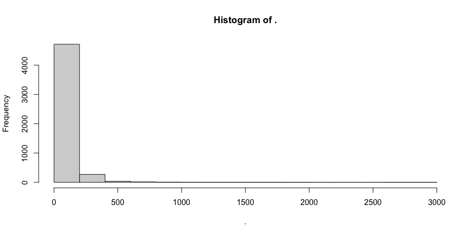<!-- -->

### Удаление хлоропластов и митохондрий


```r
ps.filtered <- subset_taxa(ps, Phylum != "NA")

asvs.keep <-ps@tax_table %>% 
      data.frame() %>%  
      filter((Family != "Mitochondria" & Order != "Chloroplast") %>%
              replace_na(TRUE)) %>% 
      rownames()
ps.notrash <- prune_taxa(asvs.keep, ps.filtered)
```

### Доля филумов в образцах


```r
bargraph <- function(ps, rank, threshold=0.05, percents=FALSE){
  require(dplyr)
  require(ggplot2)
  require(phyloseq)
  
  ps <- prune_taxa(taxa_sums(ps) > 0, ps)
  ps2 <- tax_glom(ps, taxrank = rank)
  ps3 = transform_sample_counts(ps2, function(x) x / sum(x) )
  data <- psmelt(ps3) # create dataframe from phyloseq object
  data$Plot <- as.character(data[,rank]) # convert to character
  data$Plot[data$Abundance < threshold] <- paste0("<", threshold, " abund.")
  medians <- data %>% group_by(Plot) %>% mutate(median=median(data$Abundance))
  remainder <- medians[medians$median <= threshold,]$Plot
  data$Percentage = ifelse(data$Plot != paste0("<", threshold, " abund."),
                           round(data$Abundance, 3)*100, NA)
  
  # create palette long enough for our data
  base.palette <- c("darkblue", "darkgoldenrod1", "darkseagreen", "darkorchid", "darkolivegreen1", "lightskyblue", 
                    "darkgreen", "deeppink", "khaki2", "firebrick", "brown1", "darkorange1", "cyan1", "royalblue4", 
                    "darksalmon", "dodgerblue3", "steelblue1", "darkgoldenrod1", "brown1", "cyan1", "darkgrey")
  required.colors <- nlevels(factor(data$Plot))
  repeats = required.colors %/% length(base.palette) + 1
  palette <- rep(base.palette, length.out = repeats * length(base.palette))
  
  p <- ggplot(data=data, aes(x=Sample, y=Abundance, fill=Plot))
  p + geom_bar(aes(), stat="identity", position="stack") + theme_light() +
    scale_fill_manual(values = palette) +
    theme(legend.position="bottom") + guides() +
    theme(axis.text.x = element_text(angle = 90)) +
    if (percents) {
      geom_text(aes(label = Percentage),
                position = position_stack(vjust = 0.5), size = 1.5)
    }
  
}

bargraph(ps.notrash, "Phylum", 0.02) +
  facet_grid(~Horizont + Source ,scales = 'free_x') +
  theme(axis.text.x = element_blank())
```

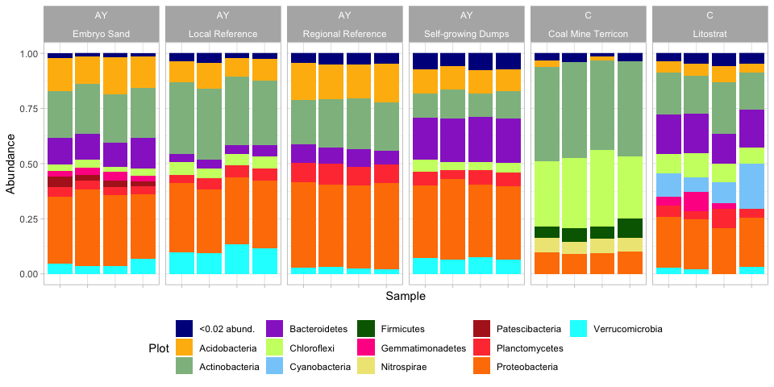<!-- -->

-   Для **почвы террикона угольных шахт** преобладают филумы Actinobacteria и Chloroflexi. Последний филлум представлен наибольшей долей, чем в остальных почвах. Только для этих почв выделяется филум Firmicutes. Только в этих почвах почти не представлены филумы Verrucomicrobia, Bacteroidetes, Acidobacteria.

-   Для всех почв кроме почвы террикона угольных шахт большую долю составляет филум Proteobacteria

-   Для почвы **литострат** филумы распределены относительно равномерно без конкретных выдающихся филумов

### Альфа разнообразие


```r
ps.raref <- rarefy_even_depth(ps.notrash, sample.size = 8000)
```

```
## You set `rngseed` to FALSE. Make sure you've set & recorded
##  the random seed of your session for reproducibility.
## See `?set.seed`
```

```
## ...
```

```
## 54OTUs were removed because they are no longer 
## present in any sample after random subsampling
```

```
## ...
```


```r
plot_richness(ps.raref, x = "Source", measures=c("Observed", "Shannon"), color = "Horizont")
```

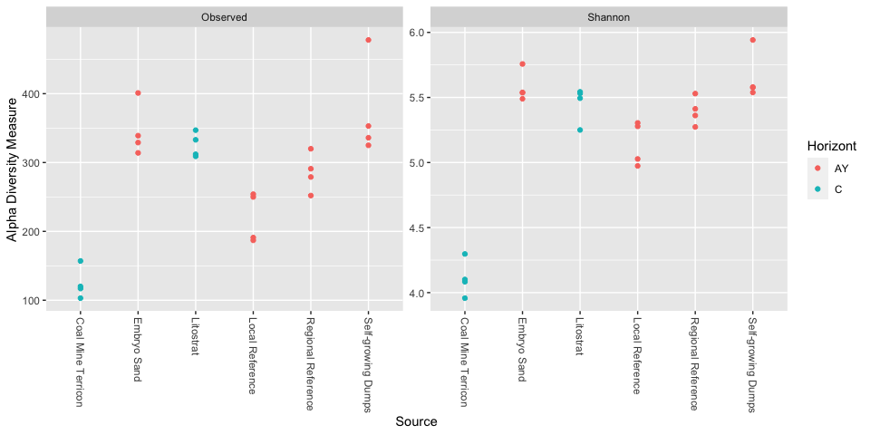<!-- -->

### Бета разнообразие


```r
ordinations <- ordinate(ps.notrash, "NMDS", "bray")
```

```
## Square root transformation
## Wisconsin double standardization
## Run 0 stress 0.1238612 
## Run 1 stress 0.1925934 
## Run 2 stress 0.1238612 
## ... Procrustes: rmse 3.225822e-06  max resid 6.295032e-06 
## ... Similar to previous best
## Run 3 stress 0.1365259 
## Run 4 stress 0.1365259 
## Run 5 stress 0.1365259 
## Run 6 stress 0.1238612 
## ... Procrustes: rmse 1.311881e-06  max resid 3.019432e-06 
## ... Similar to previous best
## Run 7 stress 0.1365259 
## Run 8 stress 0.1238612 
## ... Procrustes: rmse 1.536109e-06  max resid 2.764826e-06 
## ... Similar to previous best
## Run 9 stress 0.1365259 
## Run 10 stress 0.1238612 
## ... Procrustes: rmse 4.898734e-06  max resid 9.732725e-06 
## ... Similar to previous best
## Run 11 stress 0.1238612 
## ... Procrustes: rmse 5.595959e-06  max resid 1.684162e-05 
## ... Similar to previous best
## Run 12 stress 0.1238612 
## ... Procrustes: rmse 5.233363e-06  max resid 9.936984e-06 
## ... Similar to previous best
## Run 13 stress 0.1238612 
## ... Procrustes: rmse 3.098849e-06  max resid 6.05153e-06 
## ... Similar to previous best
## Run 14 stress 0.1238612 
## ... Procrustes: rmse 1.62131e-06  max resid 3.255668e-06 
## ... Similar to previous best
## Run 15 stress 0.2021719 
## Run 16 stress 0.1365259 
## Run 17 stress 0.1238612 
## ... Procrustes: rmse 2.847342e-06  max resid 5.624336e-06 
## ... Similar to previous best
## Run 18 stress 0.1238612 
## ... Procrustes: rmse 1.952479e-06  max resid 3.763567e-06 
## ... Similar to previous best
## Run 19 stress 0.1365259 
## Run 20 stress 0.1925934 
## *** Best solution repeated 10 times
```


```r
plot_ordination(ps.notrash, ordinations, type="taxa", color="Phylum")
```

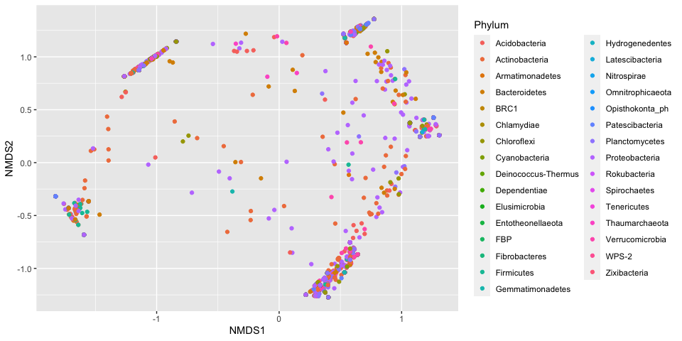<!-- -->


```r
plot_ordination(ps.notrash, ordinations, type="samples", color="Source", shape = "Horizont")
```

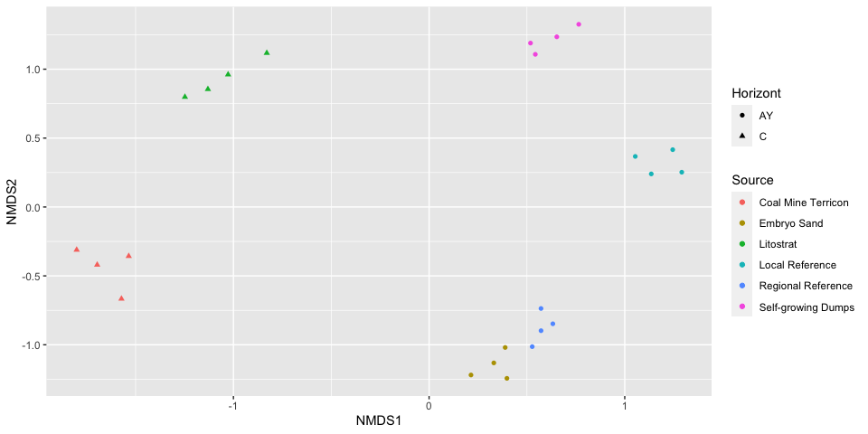<!-- -->
