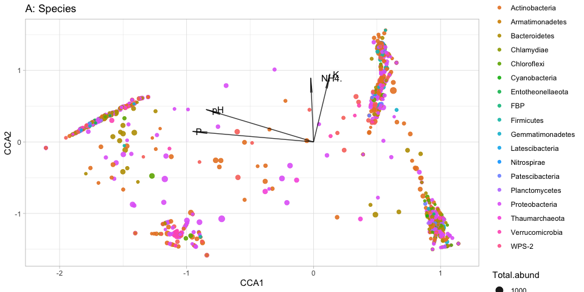

```r
knitr::opts_chunk$set(fig.width = 10, warning=F, error=F, message = F)
setwd(dirname(rstudioapi::getActiveDocumentContext()$path))
set.seed(777)
library(tidyverse)
```

```
## ── Attaching packages ─────────────────────────────────────── tidyverse 1.3.2 ──
## ✔ ggplot2 3.4.2     ✔ purrr   1.0.1
## ✔ tibble  3.2.1     ✔ dplyr   1.1.2
## ✔ tidyr   1.3.0     ✔ stringr 1.5.0
## ✔ readr   2.1.3     ✔ forcats 0.5.2
## ── Conflicts ────────────────────────────────────────── tidyverse_conflicts() ──
## ✖ dplyr::filter() masks stats::filter()
## ✖ dplyr::lag()    masks stats::lag()
```

```r
library(phyloseq)
library(vegan)
```

```
## Loading required package: permute
## Loading required package: lattice
## This is vegan 2.6-4
```

```r
remotes::install_github("pmartinezarbizu/pairwiseAdonis/pairwiseAdonis")
```

```
## Skipping install of 'pairwiseAdonis' from a github remote, the SHA1 (cb190f76) has not changed since last install.
##   Use `force = TRUE` to force installation
```

## Фильтрация по агрохимии

Загружаем объект phyloseq без органелл из прошлой домашней работы


```r
ps <- readRDS('../Дз1/ps_no_organnel.RData')
```

Добавляем информацию об агрохимии


```r
agro <- read.csv('agro.csv')
new_sam_data <- merge(as.data.frame(ps@sam_data), agro,
                      by=c('Site','Repeat'),all=T)
rownames(new_sam_data) <- new_sam_data$SampleID
ps@sam_data <- sample_data(new_sam_data)
```

Удаляем образцы, где отсутствует агрохимии


```r
ps_agro <- subset_samples(ps, !is.na(pH))
```

## Альфа разнообразие


```r
ps.raref <- rarefy_even_depth(ps_agro)
```


```r
plot_richness(ps.raref, x = "Source", measures=c("Observed", "Simpson"), color = "Horizont")
```

<!-- -->

Гипотеза: альфа разнообразие больше в почвенном горизонте AY, чем в C.

Сделаем таблицу с образцами их значениями альфа разнообразия.


```r
alpha_div <- function(ps, measures){
  ps <- prune_taxa(taxa_sums(ps) > 0, ps)
  obs_sim <- estimate_richness(ps, measures = measures)
  Horizont <- ps@sam_data$Horizont
  Source <- ps@sam_data$Source
  alpha <- cbind(obs_sim, Horizont, Source)
  return(alpha)
}

alpha <- alpha_div(ps.raref, c("Observed", "Simpson"))
head(alpha)
```

```
##                            Observed   Simpson Horizont             Source
## Self.growing.Dumps.B1.AY.1      351 0.9954395       AY Self-growing Dumps
## Litostrat.B2.C.1                336 0.9947644        C          Litostrat
## Litostrat.B2.C.2                308 0.9950729        C          Litostrat
## Litostrat.B2.C.3                347 0.9944481        C          Litostrat
## Litostrat.B2.C.4                311 0.9906282        C          Litostrat
## Self.growing.Dumps.B1.AY.2      324 0.9953683       AY Self-growing Dumps
```


```r
wilcox.test(Observed ~ Horizont, data = alpha)
```

```
## 
## 	Wilcoxon rank sum exact test
## 
## data:  Observed by Horizont
## W = 71, p-value = 0.0825
## alternative hypothesis: true location shift is not equal to 0
```

```r
wilcox.test(Simpson ~ Horizont, data = alpha)
```

```
## 
## 	Wilcoxon rank sum exact test
## 
## data:  Simpson by Horizont
## W = 84, p-value = 0.004096
## alternative hypothesis: true location shift is not equal to 0
```

Для количества ASV тест Уилкоксона отвергает гипотезу о различии между горизонтами, а для коэффициента Симпсона гиптоеза принимается.


```r
aov <- aov(Observed ~ Horizont + Source, data = alpha)
cat('Observed',"\n")
```

```
## Observed
```

```r
summary(aov)
```

```
##             Df Sum Sq Mean Sq F value   Pr(>F)    
## Horizont     1  36855   36855   20.73 0.000381 ***
## Source       3 133139   44380   24.96 4.41e-06 ***
## Residuals   15  26672    1778                     
## ---
## Signif. codes:  0 '***' 0.001 '**' 0.01 '*' 0.05 '.' 0.1 ' ' 1
```

```r
cat("\n",'Simpson',"\n")
```

```
## 
##  Simpson
```

```r
aov <- aov(Simpson ~ Horizont + Source, data = alpha)
summary(aov)
```

```
##             Df    Sum Sq   Mean Sq F value   Pr(>F)    
## Horizont     1 0.0005654 0.0005654  176.47 1.06e-09 ***
## Source       3 0.0007946 0.0002649   82.67 1.48e-09 ***
## Residuals   15 0.0000481 0.0000032                     
## ---
## Signif. codes:  0 '***' 0.001 '**' 0.01 '*' 0.05 '.' 0.1 ' ' 1
```

Двухфакторный ANOVA показывает, что средние при группировке по обеим группам различаются для обеих метрик альфа разнообразия.

## Бета разнообразие


```r
ps.prop <- transform_sample_counts(ps_agro, function(x) x/sum(x))
ord.pcoa.bray <- ordinate(ps.prop, method='PCoA', distance='bray')
plot_ordination(ps.prop, ord.pcoa.bray, color = 'Source', shape = "Horizont") +
    geom_point(size=3, alpha=0.7) + 
    theme_light()
```

<!-- -->

Гипотезы

-   Горизнонты AY и С формируют отдельные кластеры

-   Почвы горизонта C формируют отдельные кластеры


```r
dist <- phyloseq::distance(ps_agro, method = "bray")
sample_df <- data.frame(sample_data(ps_agro))
 
permanova <- adonis2(dist ~ Horizont + Source, data = sample_df)
permanova
```

```
## Permutation test for adonis under reduced model
## Terms added sequentially (first to last)
## Permutation: free
## Number of permutations: 999
## 
## adonis2(formula = dist ~ Horizont + Source, data = sample_df)
##          Df SumOfSqs      R2      F Pr(>F)    
## Horizont  1   1.5357 0.18124 7.7082  0.001 ***
## Source    3   3.9491 0.46607 6.6073  0.001 ***
## Residual 15   2.9884 0.35269                  
## Total    19   8.4731 1.00000                  
## ---
## Signif. codes:  0 '***' 0.001 '**' 0.01 '*' 0.05 '.' 0.1 ' ' 1
```

Пермутационные ANOVA тест подверждает гипотезу об отдельных кластерах между горизонтами почв. В дополнение различные типы почв не образуют один единый кластер.


```r
# Use pairwise adonis as a post-hoc test
ay.only.ps <- subset_samples(ps_agro, Horizont == "AY")
ay.only.dist <- phyloseq::distance(ay.only.ps, method = "bray")
pairwiseAdonis::pairwise.adonis(ay.only.dist, ay.only.ps@sam_data$Source)
```

```
##                                   pairs Df SumsOfSqs  F.Model        R2 p.value
## 1 Self-growing Dumps vs Local Reference  1  1.052133 3.820301 0.3890207   0.036
## 2     Self-growing Dumps vs Embryo Sand  1  1.237369 4.951309 0.4521203   0.027
## 3        Local Reference vs Embryo Sand  1  1.210592 4.868852 0.4479638   0.026
##   p.adjusted sig
## 1      0.108    
## 2      0.081    
## 3      0.078
```

Попарное тестирование не показало значительного различия между почвами горизонта AY


```r
c.only.ps <- subset_samples(ps_agro, Horizont == "C")
c.only.dist <- phyloseq::distance(c.only.ps, method = "bray")
pairwiseAdonis::pairwise.adonis(c.only.dist, c.only.ps@sam_data$Source)
```

```
##                             pairs Df SumsOfSqs  F.Model        R2 p.value
## 1 Litostrat vs Coal Mine Terricon  1  1.615658 14.54412 0.7079456   0.036
##   p.adjusted sig
## 1      0.036   .
```

Почвы горизонта С можно разделить на два отдельных кластера.

## Канонический корреляционный анализ 

Сделаем ККА для 1000 наиболее распространенных ASV


```r
veganifyOTU <- function(physeq){
  require(phyloseq)
  if(taxa_are_rows(physeq)){physeq <- t(physeq)}
  return(as(otu_table(physeq), "matrix"))
}

ps.top1k <- names(sort(taxa_sums(ps_agro), decreasing = TRUE)[1:1000]) %>% 
  prune_taxa(ps_agro)

otus.ps.vegan <- veganifyOTU(ps.top1k)
metadata <- as(sample_data(ps.top1k), "data.frame")

vare.cca <- vegan::cca(otus.ps.vegan ~  pH + P + K + NH4., data=metadata)
vare.cca
```

```
## Call: cca(formula = otus.ps.vegan ~ pH + P + K + NH4., data = metadata)
## 
##               Inertia Proportion Rank
## Total           7.348      1.000     
## Constrained     2.719      0.370    4
## Unconstrained   4.629      0.630   15
## Inertia is scaled Chi-square 
## 
## Eigenvalues for constrained axes:
##   CCA1   CCA2   CCA3   CCA4 
## 0.9306 0.8347 0.7234 0.2301 
## 
## Eigenvalues for unconstrained axes:
##    CA1    CA2    CA3    CA4    CA5    CA6    CA7    CA8    CA9   CA10   CA11 
## 0.9104 0.4948 0.4056 0.3838 0.3689 0.3529 0.3178 0.3098 0.2940 0.2725 0.2135 
##   CA12   CA13   CA14   CA15 
## 0.1755 0.0571 0.0489 0.0234
```

Проверим ККА модель


```r
anova(vare.cca)
```

```
## Permutation test for cca under reduced model
## Permutation: free
## Number of permutations: 999
## 
## Model: cca(formula = otus.ps.vegan ~ pH + P + K + NH4., data = metadata)
##          Df ChiSquare      F Pr(>F)    
## Model     4    2.7188 2.2025  0.001 ***
## Residual 15    4.6290                  
## ---
## Signif. codes:  0 '***' 0.001 '**' 0.01 '*' 0.05 '.' 0.1 ' ' 1
```

Модель показывает значимое качество


```r
anova(vare.cca, by="terms")
```

```
## Permutation test for cca under reduced model
## Terms added sequentially (first to last)
## Permutation: free
## Number of permutations: 999
## 
## Model: cca(formula = otus.ps.vegan ~ pH + P + K + NH4., data = metadata)
##          Df ChiSquare      F Pr(>F)    
## pH        1    0.8899 2.8837  0.001 ***
## P         1    0.7785 2.5228  0.001 ***
## K         1    0.7741 2.5083  0.001 ***
## NH4.      1    0.2763 0.8954  0.715    
## Residual 15    4.6290                  
## ---
## Signif. codes:  0 '***' 0.001 '**' 0.01 '*' 0.05 '.' 0.1 ' ' 1
```

Три фактора значимые, один фактор (концентрация аммония) незначимый.


```r
vif.cca(vare.cca)
```

```
##       pH        P        K     NH4. 
## 3.569695 3.296230 2.631677 2.369884
```

Добавим информацию о таксономии и образцах


```r
species.data <- vare.cca$CCA$v %>% 
               data.frame() %>% 
               mutate(ASV = rownames(.)) %>% 
               inner_join(data.frame(ASV = names(taxa_sums(ps.top1k)),
                                     Total.abund = taxa_sums(ps.top1k),
                                     ps.top1k@tax_table[,2], # Phylum
                                     ps.top1k@tax_table[,3]), # Class
                          by = "ASV")
species.data %>% head(10)
```

```
##         CCA1       CCA2       CCA3         CCA4   ASV Total.abund
## 1  0.5329757  1.3182210  0.6436800 -0.049745032  ASV1        2983
## 2  0.5294141  1.3160409  0.6809456  0.030382134  ASV2        2672
## 3  0.5305459  1.3218334  0.6701686  0.010257973  ASV3        1855
## 4  0.5319775  1.3233400  0.6686043  0.005109491  ASV4        1663
## 5  0.9618662 -1.1275257  0.6885568  0.135323607  ASV5        1643
## 6  0.9656651 -1.1414534  0.6619396  0.082089791  ASV6        1483
## 7  0.5106660  0.7213360 -1.3153373 -0.065623187  ASV7         625
## 8  0.5148307  0.6725879 -1.3735036  0.304743063  ASV8         640
## 9  0.5288079  1.3518950  0.6103396 -0.094337346  ASV9        1252
## 10 0.5339908  1.2977179  0.6861556  0.039285913 ASV10        1251
##            Phylum               Class
## 1     Chloroflexi                 AD3
## 2     Chloroflexi                 AD3
## 3     Chloroflexi                 AD3
## 4     Chloroflexi                 AD3
## 5   Cyanobacteria    Oxyphotobacteria
## 6   Cyanobacteria    Oxyphotobacteria
## 7  Proteobacteria Alphaproteobacteria
## 8  Proteobacteria Alphaproteobacteria
## 9  Actinobacteria      Acidimicrobiia
## 10    Chloroflexi                 AD3
```


```r
samples.data <- vare.cca$CCA$u %>% 
  data.frame() %>% 
  mutate(Names = rownames(.)) %>% 
  inner_join(ps@sam_data, by = c("Names" = "SampleID"))

samples.data
```

```
##          CCA1        CCA2          CCA3         CCA4                      Names
## 1  -1.2572235  0.57344890  1.2289023967  0.025587482 Self-growing Dumps.B1.AY.1
## 2   0.8222720 -0.51664113  1.3119719085  1.247899319           Litostrat.B2.C.1
## 3   1.1004355 -1.29911773 -0.3361136262 -0.113597574           Litostrat.B2.C.2
## 4   0.9039575 -1.37200042  0.5100271922 -1.054938146           Litostrat.B2.C.3
## 5   0.9457758 -1.06004510  0.5007811465  0.030510361           Litostrat.B2.C.4
## 6  -1.3783934  0.53728461  1.2649830105 -0.269598093 Self-growing Dumps.B1.AY.2
## 7   0.5702555  1.52585115 -0.0003647191 -0.576446814  Coal Mine Terricon.B3.C.1
## 8   0.3884558  1.20213970  0.5287335736  0.013954264  Coal Mine Terricon.B3.C.2
## 9   0.5652228  0.88898790  1.1586883542  0.586510390  Coal Mine Terricon.B3.C.3
## 10  0.4935937  1.20830721  0.5980808294  0.005537093  Coal Mine Terricon.B3.C.4
## 11 -2.0335087 -0.07657942 -0.2393443339  0.378093544 Self-growing Dumps.B1.AY.3
## 12 -0.9185831 -0.92313772 -0.4773737726 -0.812723926    Local Reference.B4.AY.1
## 13 -0.8109359 -1.44717379 -0.7885222764  0.676001975    Local Reference.B4.AY.2
## 14 -1.3547112 -1.16550748 -1.8829032161 -0.267499980    Local Reference.B4.AY.3
## 15 -1.5466235  0.33643071  0.7123557657  0.042434098 Self-growing Dumps.B1.AY.4
## 16 -1.0137773 -1.18216086 -1.0851800980 -0.129070276    Local Reference.B4.AY.4
## 17  0.5065083  1.21853955 -1.3106949932 -2.464775899        Embryo Sand.B5.AY.1
## 18  0.6300003  1.01153544 -2.0945005012  2.646635780        Embryo Sand.B5.AY.2
## 19  0.3759601 -0.15981916 -0.2998679986  0.121613180        Embryo Sand.B5.AY.3
## 20  0.5165024  0.68251059 -1.2668439289  0.097797944        Embryo Sand.B5.AY.4
##    Site Repeat      Filename             Source Horizont  pH   P   K  NH4.
## 1    B1      1  Abacumov-B-1 Self-growing Dumps       AY 7.4 178 265 26.99
## 2    B2      1 Abacumov-B-13          Litostrat        C 4.3  16 223  3.23
## 3    B2      2 Abacumov-B-14          Litostrat        C 2.6  18 134  5.42
## 4    B2      3 Abacumov-B-15          Litostrat        C 3.0  12  92  8.29
## 5    B2      4 Abacumov-B-16          Litostrat        C 3.3  15 150  5.64
## 6    B1      2  Abacumov-B-2 Self-growing Dumps       AY 7.5 185 252 28.33
## 7    B3      1 Abacumov-B-25 Coal Mine Terricon        C 5.2  80 370 46.54
## 8    B3      2 Abacumov-B-26 Coal Mine Terricon        C 5.5  80 349 36.98
## 9    B3      3 Abacumov-B-27 Coal Mine Terricon        C 5.4  52 332 27.29
## 10   B3      4 Abacumov-B-28 Coal Mine Terricon        C 5.4  71 350 36.90
## 11   B1      3  Abacumov-B-3 Self-growing Dumps       AY 7.4 258 219 19.92
## 12   B4      1 Abacumov-B-37    Local Reference       AY 5.2 170 126 16.14
## 13   B4      2 Abacumov-B-38    Local Reference       AY 4.8 166 122  0.18
## 14   B4      3 Abacumov-B-39    Local Reference       AY 5.1 229 126 13.16
## 15   B1      4  Abacumov-B-4 Self-growing Dumps       AY 7.4 207 245 25.08
## 16   B4      4 Abacumov-B-40    Local Reference       AY 5.0 188 125  9.83
## 17   B5      1 Abacumov-B-49        Embryo Sand       AY 4.3 104 303 57.87
## 18   B5      2 Abacumov-B-50        Embryo Sand       AY 4.4 120 429 24.31
## 19   B5      3 Abacumov-B-51        Embryo Sand       AY 4.3  83 235 19.74
## 20   B5      4 Abacumov-B-52        Embryo Sand       AY 4.3 102 322 33.97
```

График ККА для видов


```r
# plot species
ggplot() +
  geom_point(data=species.data,
             aes(x=CCA1, y=CCA2, color=Phylum, size=Total.abund), alpha=0.9) +
  geom_segment(data = vare.cca$CCA$biplot %>% data.frame(), 
               aes(x = 0, xend = CCA1, y = 0, yend = CCA2), 
               alpha=0.8, color = "black",arrow = arrow(angle = 3)) +
  geom_text(data = vare.cca$CCA$biplot %>% 
                    data.frame() %>% 
                    mutate(Label = rownames(.)), 
            aes(x=CCA1, y=CCA2, label= Label,
                hjust = -0.5), size=4) +
  theme_light() +
  ggtitle("A: Species")
```

<!-- -->

Графики для 10 основных филумов


```r
major.phyla <- species.data %>% 
  group_by(Phylum) %>% 
  summarize(sum = sum(Total.abund)) %>% 
  arrange(desc(sum)) %>% 
  select(Phylum) %>% 
  head(10) %>% 
  as.vector()


for (i in major.phyla$Phylum) {
  p <- ggplot() +
    geom_point(data=species.data,
               aes(x=CCA1, y=CCA2, size=Total.abund), alpha=0.2, color="grey80") +
    geom_point(data=species.data %>% filter(Phylum == i),
               aes(x=CCA1, y=CCA2, color=Class, size=Total.abund), alpha=0.9) +
    geom_segment(data = vare.cca$CCA$biplot %>% data.frame(), 
                 aes(x = 0, xend = CCA1, y = 0, yend = CCA2), 
                 alpha=0.8, color = "black",arrow = arrow(angle = 3)) +
    geom_text(data = vare.cca$CCA$biplot %>% 
                      data.frame() %>% 
                      mutate(Label = rownames(.)), 
              aes(x=CCA1, y=CCA2, label= Label,
                  hjust = -0.5), size=4) +
    theme_light() +
    ggtitle(i)
  print(p)
}
```

<!-- --><!-- --><!-- --><!-- --><!-- --><!-- --><!-- --><!-- --><!-- --><!-- -->

График для образцов


```r
# plot samples
ggplot() +
  geom_point(data=samples.data,
             aes(x=CCA1, y=CCA2, color=Source, shape = Horizont), size=3, alpha=0.7) +
  geom_segment(data = vare.cca$CCA$biplot %>% data.frame(), 
               aes(x = 0, xend = CCA1, y = 0, yend = CCA2), 
               alpha=0.8, color = "black",arrow = arrow(angle = 3)) +
  geom_text(data = vare.cca$CCA$biplot %>% 
                    data.frame() %>% 
                    mutate(Label = rownames(.)), 
            aes(x=CCA1, y=CCA2, label= Label,
                hjust = -0.5), size=4) +
  theme_light() +
  ggtitle("B. Samples")
```

<!-- -->
